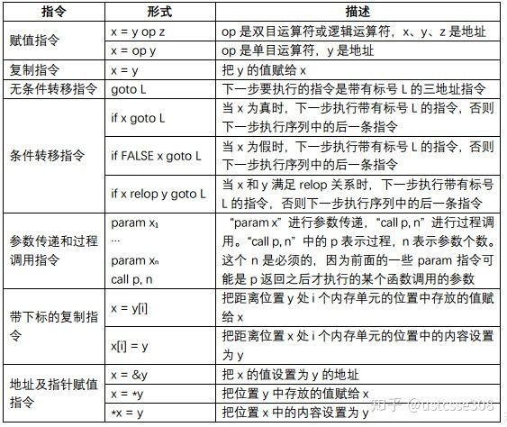

* IR：中间语言。它独立于机器，复杂性介于源码与机器码之间
* ILGen:（Intermediate Code/Language Generator）中间代码生成
* 解释器通常不生成中间码，而是直接计算结果。编译器会生成中间码，例如Java字节码
* 中间代码的设计要求：与机器无关、利于优化、利于目标代码的生成
* 中间码的作用：
  <br/>
  ~&emsp; 易移植：与机器无关，所以它作为中间语言可以为生成多种不同型号的目标机器码服务
  <br/>
  ~&emsp; 机器无关优化：对中间码进行机器无关优化，利于提高代码质量
  <br/>
  ~&emsp; 层次清晰：将AST映射成中间代码表示，再映射成目标代码的工作分层进行，使编译算法更加清晰
* 编译器所使用的IR可以有很多种形式。就其“形状”而言，可以分为：
  <br/>
  ~&emsp;基于图
  <br/>
  ~&emsp;基于线性代码
  <br/>
  ~&emsp;基于图与线性代码混合
* 基于图的IR，常见的情况有：
  <br/>
  ~&emsp;基于树
  <br/>
  ~&emsp;基于DAG（有向无环图）
  <br/>
  ~&emsp;基于一般图
* 基于线性代码的IR，常见的情况有：
  <br/>
  ~&emsp;三地址代码（四元组）
  <br/>
  ~&emsp;二地址代码（三元组）
  <br/>
  ~&emsp;零地址代码
* 基于图与线性代码混合的IR:
  <br/>
  ~&emsp;最常见的情况是控制流图（CFG）用图表示
  <br/>
  ~&emsp;而CFG的每个节点是基本块，每个基本块里的代码是线性代码
* 中间代码生成方法：https://www.bilibili.com/video/BV1cW411B7DW?p=44
  ~ 语法制导翻译
  ~ 属性文法制导翻译
* 什么是语法制导翻译：语法分析过程中，边分析，边翻译
* 语法制导翻译具体实现：为每个产生式配置一个语义子程序，当语法分析进行规约或推导时，调用语义子程序完成一部分翻译任务
* 语义子程序的主要任务：改变某些变量的值、查填各种符号表、发现并报告源程序错误、产生中间代码等
* 语义：语义跟文法不一样。例如文法E → E + E,表示一个表达式可以推导出另一个表达式加另另一个表达式，如表达式2+3*4可以拆成表达式2加上表达式3*4，虽然表达式都是E表示，但每个E的语义值不同，例如第一个E的语义值为14，第二个E的语义值为2，第三个E的语义值为12。
* 语义分析常常跟中间代码生成一起实现，所以语法分析、语义分析、中间代码生成经常是在语法分析时候一起进行的
* 语义属性：为描述语义动作，为每个文法符号赋予不同的语义属性：值、类型、地址等
* 三地址表达式：表达式中最多只能出现3个地址，因为cpu无法处理4个及其以上地址的操作。可以看成是抽象语法树的一种线性表示。* 三地址代码基于两个基本的概念：地址和指令。简单地说，地址就是运算分量，指令就是运算符，一个地址的表现形式可以是变量名、常量或者编译器生成的临时变量。下面是几种常见的三地址指令形式：
  
* 为什么选择三地址的中间形式：
    <br/>
  ~&emsp;三地址代码是一种线性IR。由于输入源程序及输出目标程序都是线性的，因此，线性IR有着其他形式无法比拟的优势。
    <br/>
  ~&emsp;相对于其他表示形式而言，程序员对于线性表示形式通常会有一种莫名的亲切感，编译器设计者当然也不例外。早期编译器设计者往往都是汇编语言程序设计的高手，可以非常自然、流畅地阅读线性的三地址代码形式。同时，线性表示形式也会降低输入输出的实现难度。
* 三地址码生成：按深度优先遍历AST，每个节点生成一个临时变量   
* 左值和右值：等号左边和右边的区别。数字1只有右值，变量可以有左值和右值
* BinaryExpr：op左右都有值的称为BinaryExpr
* UaryExpr：op只有右值，没有左值的称为UnaryExpr。例如一个表达式
* 任何一个非叶子节点都能生成一个左值和一个右值，右值是一个表达式例如100+200，左值是一个临时变量例如t1，完整：t1=100+200
* Duck Type：鸭子类型。非鸭子类型语言生成左值时需要判定左值类型是否支持生成左值
* 三地址代码实例1：
  源码：
  ```
  var a=1
  var b=5
  var c=(a+b)*5
  ```
  转换为三地址码如下：
  ```
  declare a 
  declare b
  declare c
  a=1
  b=5
  t1=a+b
  t2=t1*5
  c=t2
  ```
  分析：实例展示了从js源码到三地址码，再到机器码的过程，可以看到三地址码的每行代码永远只存在三个变量。以上只需要按深度优先遍历AST，每个节点生成一个临时变量即可生成。
* 三地址表达式实例2：
  源码：
  ```
  function f(n){
    if(n==1 || n==2){
      return n
    }
    return f(n-1)+f(n-2)
  }
  f(5)
  ```
  转换为三地址码如下：
  ```
  declare f
  declare n  
  t1=n==1
  t2=n==2
  t3=t1 or t2
  branch t3==true
  goto (return n)行 or (return f(n-1)+f(n-2))行 //return怎么处理？？
  t4=n-1
  t5=f(t4)  //如何递归
  t6=n-2
  t7=f(t6)  //如何递归
  t8=t5+t7
  call f   //如何调用
  ```
* 文档：
  <br/>
  &emsp; 中间码简介：https://www.jianshu.com/p/2862623af39e
  <br/>
  &emsp; 中间码的形式：https://www.hashcoding.net/2015/12/10/%E5%85%AD%E3%80%81%E4%B8%AD%E9%97%B4%E4%BB%A3%E7%A0%81-IR/
  <br/>
  &emsp; 中间码的设计：https://book.51cto.com/art/201206/340208.htm
  <br/>
  &emsp; 图解各种三地址码的特点1：https://blog.csdn.net/SHU15121856/article/details/104711426/
  <br/>
  &emsp; 图解各种三地址码的特点2：https://blog.csdn.net/raojun/article/details/103605349
* 要使目标代码正确执行，由上面的三地址码直接转为的目标代码还是不够的，例如在不同作用域中存在同样变量名，我们如何在运行时确定变量的存储单元。所以我们还需要知道程序执行时的上下文环境、变量的作用域等信息才能生成准确的机器码。这些知识我们将在[04_运行时刻环境](../04_运行时刻环境/README.md)中学习到，并生成正确的中间代码